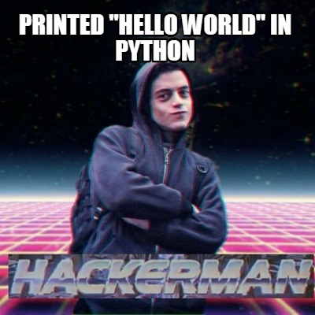

# Interacting with Python

Now that you have a basic understanding of what Python is and its uses. Let's start interacting with Python.
By the end of this section, you will know how to execute code in a script file and work within a Python Integrated Development Environment (or IDE for short).

I recommend that you use your iPad, or your laptop or desktop starting at this point so that it is easier for you to code.

1. Go to [replit](https://replit.com/signup) and sign up using your school email or preferred email address.
2. Then click on "+ New repl" blue button located at the top-right of your screen, below your profile name and picture.
3. You will be prompted to choose a language and name your repl. Pick Python as your repl language and name your repl anything.
4. You could call it **Hello, World**. Then click on "Create repl", once everything loads, you are good to go :)

---

### Note

If you are stuck on anything of the above steps, you can also check the [video](#interacting-with-python), or join the [support channel](https://hilgrove.codes/support)

---

## Your first "Hello, World!" program

After setting up your development environment using [replt](https://replit.com/), we can now create our first Python program.
Make sure you are inside your *repl* we just created. There is a long-standing custom in the computer programming field that the first code written in a newly installed language is a short program that displays the string "Hello, World!" to the console.

The simplest Python 3 code to display Hello, World! is:

```py
print("Hello, World!")
```

What this is going to do, is to print out "Hello, World!" onto the screen. This screen is called a console.
So whatever you put inside the quotation marks will be printed out onto the console. 
Type in the above code and click "Run" at the top of your screen inside your REPL Integrated Development Environment.

<p align="center">
  
</p>

---

### Fun Fact

This is a time-honored tradition dating back to the 1970s. See [Hello, World!](https://en.wikipedia.org/wiki/%22Hello,_World!%22_program) for a brief history. You seriously risk upsetting the _qi_ of the universe if you do not abide by this custom

---

You can also have multiple print statements that make up a story, like this:

```py
print("There once was a lady named Amelia, ")
print("she was 24 years old. ")
print("She really liked the name Amelia, ")
print("but didn't like being 24. ")
```

---
### Important note

Python is a `case-sensitive` language. Meaning that lower case and upper case characters have different meanings.

---

For example, you cannot run

```py
PRINT("There once was a lady named Amelia, ")
pRint("she was 24 years old. ")
Print("She really liked the name Amelia, ")
prinT("but didn't like being 24. ")
```

To conclude, the `print` statement will print whatever you put inside the quotation marks (a string) to the console.
